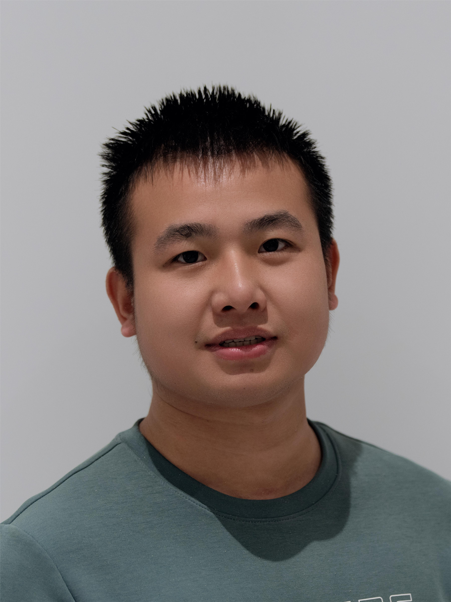
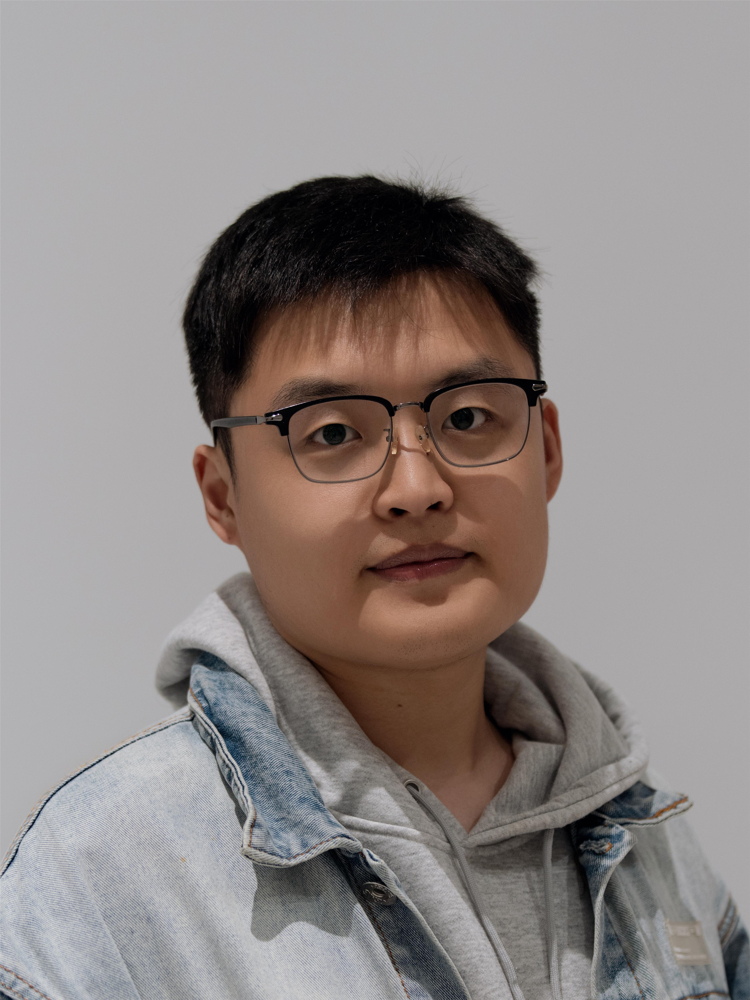
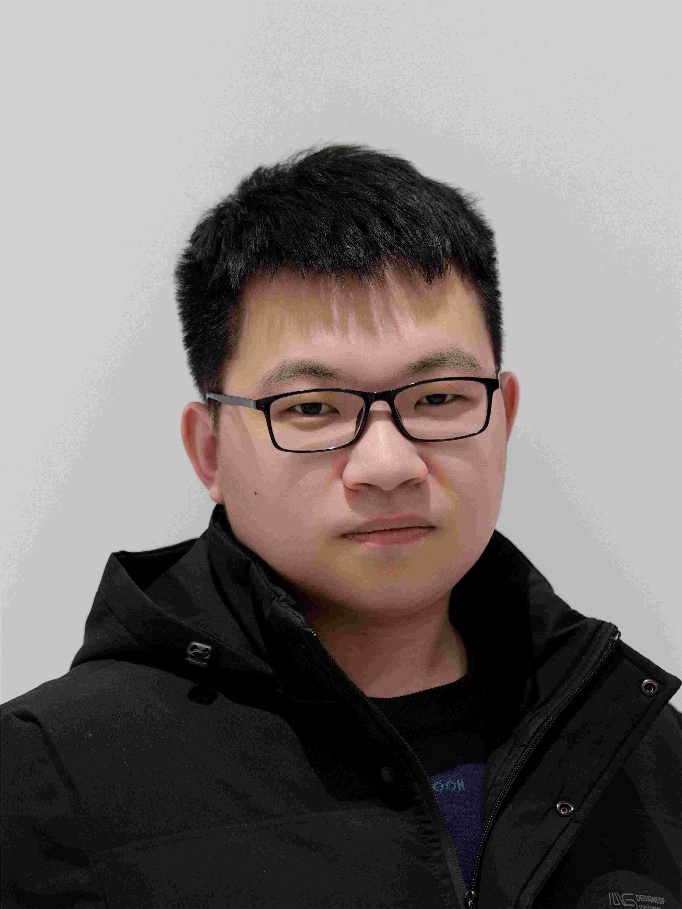

---
# An instance of the Contact widget.
# Documentation: https://wowchemy.com/docs/page-builder/
widget: contact

# This file represents a page section.
headless: true

# Order that this section appears on the page.
weight: 10

title:
subtitle:

design:
  columns: '1'
---

### Group Members

#### Group leader

---

 |                                                             |                                                              |
 |:----------------------------------------------------------- | :----------------------------------------------------------- |
 | | **Group leader, Yingming Qu** 

#### Doctoral students

---

 |                                                             |                                                              |
 |:----------------------------------------------------------- | :----------------------------------------------------------- |
 | | **2023-Present, Jiajun Song: Geological Resources and Geological Engineering** Jiajun Song is a graduate student directly recommended by China University of Petroleum(East China) and currently pursuing an integrated master-doctoral program. He has received the Recipient of the Sun Yueqi Outstanding Student Award, First Prize in the National College Students Innovation and Entrepreneurship Competition, Silver Award in the National International Internet+ Competition, and Bronze Award in the National College Students Entrepreneurship Plan Competition. He has also served as the Part-time Deputy Secretary of the University's Youth League Committee. |
 |                                                      |                                                              |
 | | **2022-Present, Yixin Wang: Geological Resources and Geological Engineering** Yixin Wang graduated from Shandong University of Science and Technology with a bachelor's degree. She pursued a master's degree in Geophysics at the China University of Petroleum (East China) after achieving the first rank in the postgraduate entrance examination. Currently, she is a doctoral student in an integrated master-doctoral program. She has been awarded the National Scholarship for Master's Students, the Outstanding Paper Award from the China Petroleum Society, the First Prize in the National College Students Innovation and Entrepreneurship Competition, and the Gold Award in the National International Internet+ Competition. |
 |          
 | | **2023-Present, Qi Zhang: Geological Resources and Geological Engineering** Qi Zhang is  a graduate student directly recommended by China University of Petroleum(East China) and currently pursuing an integrated master-doctoral program. He has been awarded the First Prize in the Oriental Cup Development Competition.  ● graduated university: China University of Petroleum (East China)   ● research interest: low frequency noise suppression   ● hobbies:listening to music and taking walks  ● hometown:Jingzhou, Hubei |
 |          
 | | **2023-Present, Yifan Li: Geological Resources and Geological Engineering** Yifan Li is a graduate student directly recommended by China University of Petroleum(East China) and currently pursuing an integrated master-doctoral program. She has won first prize in the 9th "Oriental Cup" National College Students Exploration Geophysics Competition, third prize in the 1st "Oriental Cup" National College Students Exploration Geophysics Software Development Competition, second prize in the 7th "Innovation Cup" National College Students Geophysics Knowledge Competition, second prize in the 13th Anniversary Elite League of the National 3D Competition (2020-2021) Longding Award Digital Industrial Design Competition, and third prize in the 12th Shandong Province College Students Science and Technology Festival -2020 Digital Media Creative Competition. As the team leader, she led a college student innovation and entrepreneurship plan and won an excellent conclusion.She has received multiple academic scholarships, the honorary title of "Outstanding Individual in Military Training", and the honorary titles of "Outstanding Graduate Cadre", "Outstanding Graduate Student", "Outstanding Communist Youth League Cadre", and "Outstanding Communist Youth League Member". She participated in the 2019 "54 Years Youth Gala", was selected for the 2021 School of Thought and Beauty Star Finals, and was nominated for the "Thought and Beauty Star" award. She led the school's national flag guard team to achieve the first place in the overall ranking of the 9th "Beautiful Mind · Sunshine University" Most Beautiful Team, participated in the school fitness festival (tennis group) competition, and achieved the fourth place in the team.She has served as the captain of the honor guard team at China University of Petroleum (October 2020 to October 2021), the class monitor of the honor guard team at China University of Petroleum (October 2019 to October 2020), and the Youth League Secretary of Class 2. |
 |          
 | | **2022-Present, Chang Liu: Geological Resources and Geological Engineering** Chang Liu graduated in June 2017 with a degree in Geophysics from the College of Disaster Prevention Science and Technology and in June 2020 with a degree in Geological Engineering from China University of Petroleum (East China). His current research interests are seismic interferometric imaging methods based on staining algorithms. He likes board games, is passionate about e-sports, and has a good sense of teamwork. |
 |          
        

#### Master students

---

 |                                                             |                                                              |
 |:----------------------------------------------------------- | :----------------------------------------------------------- |
  | | **2020-2023, Xin Liu: Geological Engineering** Xin Liu is a graduate student from China University of Petroleum (East China) in 2020. His research interest is seismic wave propagation and imaging. At school, he was funded by the China Scholarship Council and won the third prize in the National Seismic Exploration Software Processing Competition. He loves life and work, and currently works for Eight Bureau Development and Construction Co., LTD.
 |                                                      |    
 | | **2021-Present, Lide Peng: Geological Resources and Geological Engineering** Lide Peng, graduated from China University of Petroleum (East China) with a Bachelor's degree in Geophysics in June 2016. In September 2016, he studied for a master's degree in Geological Resources and Geological Engineering at China University of Petroleum (East China). His current research interests are forward modeling of complex media and seismic illumination. His hobbies include football and running.
 |                                                      |                                                              |
 | | **2021-Present, Mengjie Li: Geological Engineering** Mengjie Li has been studying at China University of Petroleum (East China) since 2017 and received her bachelor's degree in 2021. She is currently pursuing her master's degree. Her research focuses on low frequency noise suppression in seismic imaging. In her free time, she likes listening to music and taking walks.  ● graduated university: China University of Petroleum (East China)   ● research interest: low frequency noise suppression   ● hobbies:listening to music and taking walks  ● hometown:Jingzhou, Hubei
 |                                                      |                                                              |
 | | **2021-Present, Tianmiao Zhong:  Geophysics** Tianmiao Zhong graduated from China University of Petroleum (East China) with a Bachelor's degree in Geophysics in June 2021. In September 2021, He studied for a master's degree in Geophysics at China University of Petroleum (East China). His current research interests are reflected wave inversion and full waveform inversion. He doesn't have any hobbies. |
 |  
 | | **2022-Present, Longfu Xie: Geological Resources and Geological Engineering** Longfu Xie graduated from East China University of Technology with a bachelor's degree in geophysics in June 2022. He joined China University of Petroleum (East China) in September 2022 and started his master's degree program. His current work focuses on frequency-domain forward modeling, frequency-domain inverse time offset, and frequency-domain full waveform inversion. In his spare time, He enjoys playing badminton and ping pong.  ● graduated university: China University of Petroleum (East China)   ● research interest: low frequency noise suppression   ● hobbies:listening to music and taking walks  ● hometown:Jingzhou, Hubei |
 |                                                         |                                                              |
 | | **2022-Present, Zezheng Ding:  Geological Resources and Geological Engineering** Zezheng Ding graduated from Xi'an Shiyou University with a bachelor’s degree in Geoscience in June 2022. He joined the China University of Petroleum (East China) in September 2022.  In his free time, he loves outdoor activities such as climbing and playing soccer.  ● graduated university: China University of Petroleum (East China)   ● research interest: low frequency noise suppression   ● hobbies:listening to music and taking walks  ● hometown:Jingzhou, Hubei |
 |          
 | | **2022-Present, Tongyi Tao:  Geological Resources and Geological Engineering** Tongyi Tao graduated from Shan with a bachelor’s degree in Geoscience in June 2022. He joined the China University of Petroleum (East China) in September 2022. In his free time, he loves outdoor activities such as photoing and playing soccer.  ● graduated university: China University of Petroleum (East China)   ● research interest: low frequency noise suppression   ● hobbies:listening to music and taking walks  ● hometown:Jingzhou, Hubei |
 |       
 | | **2023-Present, Yunbo Niu:  Geological Resources and Geological Engineering** Yunbo Niu obtained his Bachelor's degree in Exploration Technology and Engineering from Chongqing University of Science and Technology in June 2023. He joined China University of Petroleum (East China) in September 2023 to pursue a Master's degree. His current primary focus lies in utilizing physical information neural networks for seismic wave forward modeling and inversion imaging. During his leisure time, he enjoys engaging in literary readings and playing soccer.  ● graduated university: China University of Petroleum (East China)   ● research interest: low frequency noise suppression   ● hobbies:listening to music and taking walks  ● hometown:Jingzhou, Hubei |
 |       
 | | **2022-Present, Laijin Bi:  Geological Resources and Geological Engineering** Laijin Bi graduated from Northeast Petroleum University in June 2022 with a Bachelor's degree in Geophysics. He joined China University of Petroleum (East China) in September 2022 and began pursuing a master's degree. His current focus of work is on reverse time migration based on irregular topography, as well as research on the method study of pre-stack wave equation depth migration methods based on irregular topography. In his spare time, he likes to play football.  ● graduated university: China University of Petroleum (East China)   ● research interest: low frequency noise suppression   ● hobbies:listening to music and taking walks  ● hometown:Jingzhou, Hubei |
 |  
 | | **2022-Present, Shihao Dong:  Geological Resources and Geological Engineering** Shihao Dong graduated from Shandong University of Science and Technology with a bachelor's degree in Prospecting Technology and Engineering in June 2022. He joined the China University of Petroleum (East China) in September 2022 and started pursuing Ph.D. His current work mainly focused on Q-compensated reverse time migration CUDA-based and 3D least-square reverse time migration.  ● graduated university: China University of Petroleum (East China)   ● research interest: low frequency noise suppression   ● hobbies:listening to music and taking walks  ● hometown:Jingzhou, Hubei |
 |  
 | | **2022-Present, Jie Zhao:  Geological Resources and Geological Engineering** Jie Zhao graduated with a bachelor's degree in Exploration Technology and Engineering from China University of Petroleum (East China) in June 2023. He joined China University of Petroleum (East China) in September 2023 and began pursuing a master's degree. The current work mainly focuses on the full waveform inversion of multi-scale elastic waves. In his free time, he enjoys outdoor activities such as mountaineering and various ball games.  ● graduated university: China University of Petroleum (East China)   ● research interest: low frequency noise suppression   ● hobbies:listening to music and taking walks  ● hometown:Jingzhou, Hubei |
 |  
 | | **2023-Present, Yanpeng Yang:  Geological Resources and Geological Engineering** Yanpeng Yang graduated from Shandong University of Technology in June 2023 with a bachelor's degree in geoscience. He joined China University of Petroleum (East China) in September 2023 to begin his master's degree. The current work mainly focuses on seismic record reconstruction and sparse transformation based on compressed sensing. In his free time, he likes playing football and badminton.  ● graduated university: China University of Petroleum (East China)   ● research interest: low frequency noise suppression   ● hobbies:listening to music and taking walks  ● hometown:Jingzhou, Hubei |
 |  
 | | **2023-Present, Zihan Xu:  Geological Resources and Geological Engineering** Zihan Xu is a graduate student directly recommended by China University of Petroleum (East China) in June 2023 and currently pursuing a master’s degree. He has received the The 9th Shandong Province College Students ‘Internet+’ Innovation and Entrepreneurship Competition. His current work mainly focused on the Marchenko imaging and least-squares reverse time migration. In his free time, he loves playing table tennis.  ● graduated university: China University of Petroleum (East China)   ● research interest: low frequency noise suppression   ● hobbies:listening to music and taking walks  ● hometown:Jingzhou, Hubei |
 |  
 | | **2023-Present, Shenghong Yu:  Geological Resources and Geological Engineering** Shenghong Yu graduated from China University of Petroleum (East China) in June 2021 with a B.S. degree in Information and Computing Science. He joined the Department of Geophysics, College of Geoscience and Technology, China University of Petroleum (East China) in September 2023 and started his master's degree. His current work focuses on finite difference, acoustic-elastic coupling seismic exploration simulation. In his spare time, he enjoys playing badminton and billiards.  ● graduated university: China University of Petroleum (East China)   ● research interest: low frequency noise suppression   ● hobbies:listening to music and taking walks  ● hometown:Jingzhou, Hubei |
 |  

### Openings

We are looking for qualified students with strong motivation on geophysics. Please feel free to contact Dr. Yingming Qu ([quyingming@upc.edu.cn](mailto:quyingming@upc.edu.cn)) if you have any questions about master and doctoral application at China University of Petroleum.