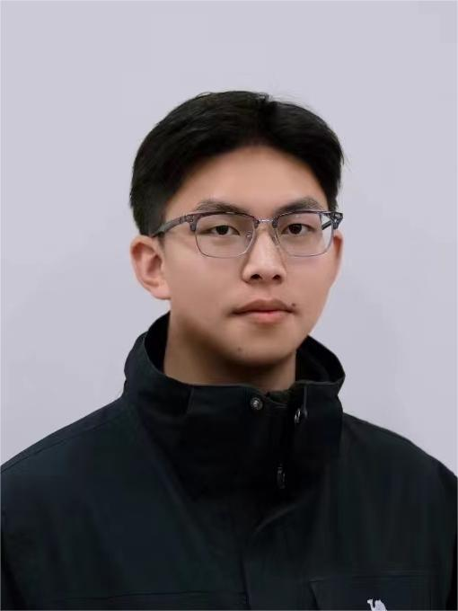
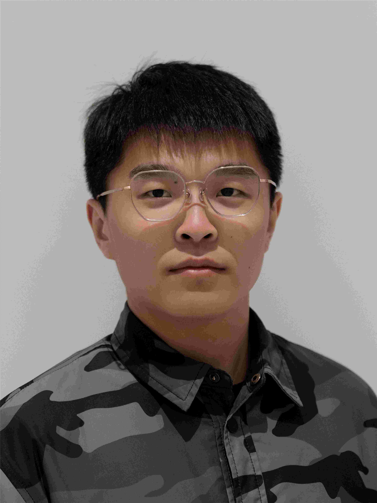

---
# An instance of the Contact widget.
# Documentation: https://wowchemy.com/docs/page-builder/
widget: contact

# This file represents a page section.
headless: true

# Order that this section appears on the page.
weight: 10

title:
subtitle:

design:
  columns: '1'
---

### Group Members

#### Group leader

---

 |                                                             |                                                              |
 |:----------------------------------------------------------- | :----------------------------------------------------------- |
 | | **Group leader, Yingming Qu** 

#### Doctoral students

---

 |                                                             |                                                              |
 |:----------------------------------------------------------- | :----------------------------------------------------------- |
 | | **2023-Present, Jiajun Song: Geological Resources and Geological Engineering** Jiajun Song is a graduate student directly recommended by China University of Petroleum(East China) and currently pursuing an integrated master-doctoral program. He has received the Recipient of the Sun Yueqi Outstanding Student Award, First Prize in the National College Students Innovation and Entrepreneurship Competition, Silver Award in the National International Internet+ Competition, and Bronze Award in the National College Students Entrepreneurship Plan Competition. He has also served as the Part-time Deputy Secretary of the University's Youth League Committee. |
 |                                                      |                                                              |
 | | **2022-Present, Yixin Wang: Geological Resources and Geological Engineering** Yixin Wang graduated from Shandong University of Science and Technology with a bachelor's degree. She pursued a master's degree in Geophysics at the China University of Petroleum (East China) after achieving the first rank in the postgraduate entrance examination. Currently, she is a doctoral student in an integrated master-doctoral program. She has been awarded the National Scholarship for Master's Students, the Outstanding Paper Award from the China Petroleum Society, the First Prize in the National College Students Innovation and Entrepreneurship Competition, and the Gold Award in the National International Internet+ Competition. |
 |          
 | | **2023-Present, Qi Zhang: Geological Resources and Geological Engineering** Qi Zhang is  a graduate student directly recommended by China University of Petroleum(East China) and currently pursuing an integrated master-doctoral program. He has been awarded the First Prize in the Oriental Cup Development Competition. |
 |          
 | | **2023-Present, Yifan Li: Geological Resources and Geological Engineering** Yifan Li is a graduate student directly recommended by China University of Petroleum(East China) and currently pursuing an integrated master-doctoral program. She has won first prize in the 9th "Oriental Cup" National College Students Exploration Geophysics Competition, third prize in the 1st "Oriental Cup" National College Students Exploration Geophysics Software Development Competition, second prize in the 7th "Innovation Cup" National College Students Geophysics Knowledge Competition, second prize in the 13th Anniversary Elite League of the National 3D Competition (2020-2021) Longding Award Digital Industrial Design Competition, and third prize in the 12th Shandong Province College Students Science and Technology Festival -2020 Digital Media Creative Competition. As the team leader, she led a college student innovation and entrepreneurship plan and won an excellent conclusion.She has received multiple academic scholarships, the honorary title of "Outstanding Individual in Military Training", and the honorary titles of "Outstanding Graduate Cadre", "Outstanding Graduate Student", "Outstanding Communist Youth League Cadre", and "Outstanding Communist Youth League Member". She participated in the 2019 "54 Years Youth Gala", was selected for the 2021 School of Thought and Beauty Star Finals, and was nominated for the "Thought and Beauty Star" award. She led the school's national flag guard team to achieve the first place in the overall ranking of the 9th "Beautiful Mind · Sunshine University" Most Beautiful Team, participated in the school fitness festival (tennis group) competition, and achieved the fourth place in the team.She has served as the captain of the honor guard team at China University of Petroleum (October 2020 to October 2021), the class monitor of the honor guard team at China University of Petroleum (October 2019 to October 2020), and the Youth League Secretary of Class 2. |
 |          
 | | **2022-Present, Chang Liu: Geological Resources and Geological Engineering** Chang Liu graduated in June 2017 with a degree in Geophysics from the College of Disaster Prevention Science and Technology and in June 2020 with a degree in Geological Engineering from China University of Petroleum (East China). His current research interests are seismic interferometric imaging methods based on staining algorithms. He likes board games, is passionate about e-sports, and has a good sense of teamwork. |
 |          
        

#### Master students

---

 |                                                             |                                                              |
 |:----------------------------------------------------------- | :----------------------------------------------------------- |
 | | **2021-Present, Lide Peng: Geological Resources and Geological Engineering** Lide Peng, graduated from China University of Petroleum (East China) with a Bachelor's degree in Geophysics in June 2016. In September 2016, he studied for a master's degree in Geological Resources and Geological Engineering at China University of Petroleum (East China). His current research interests are forward modeling of complex media and seismic illumination. His hobbies include football and running.
 |                                                      |                                                              |
 | | **2022-Present, Longfu Xie: Geological Resources and Geological Engineering** Longfu Xie graduated from East China University of Technology with a bachelor's degree in geophysics in June 2022. He joined China University of Petroleum (East China) in September 2022 and started his master's degree program. His current work focuses on frequency-domain forward modeling, frequency-domain inverse time offset, and frequency-domain full waveform inversion. In his spare time, He enjoys playing badminton and ping pong. |
 |                                                         |                                                              |
 | | **2022-Present, Zezheng Ding: Deep Learning for seismic imaging and inversion** Zezheng Ding graduated from Xi'an Shiyou University with a bachelor’s degree in Geoscience in June 2022. He joined the China University of Petroleum (East China) in September 2022 and started pursuing Ph.D. His current work mainly focused on using the deep learning for seismic AVO inversion, least-squares migration, diffraction/reflection separation and wavefield separation. In his free time, he loves outdoor activities such as climbing and skiing. |
 |          
 | | **2022-Present, Tongyi Tao: Deep Learning for seismic imaging and inversion** Tongyi Tao graduated from Shan with a bachelor’s degree in Geoscience in June 2022. He joined the China University of Petroleum (East China) in September 2022 and started pursuing Ph.D. His current work mainly focused on using the deep learning for seismic AVO inversion, least-squares migration, diffraction/reflection separation and wavefield separation. In his free time, he loves outdoor activities such as climbing and skiing. |
 |       

### Openings

We are looking for qualified students with strong motivation on geophysics. Please feel free to contact Dr. Yingming Qu ([quyingming@upc.edu.cn](mailto:quyingming@upc.edu.cn)) if you have any questions about master and doctoral application at China University of Petroleum.