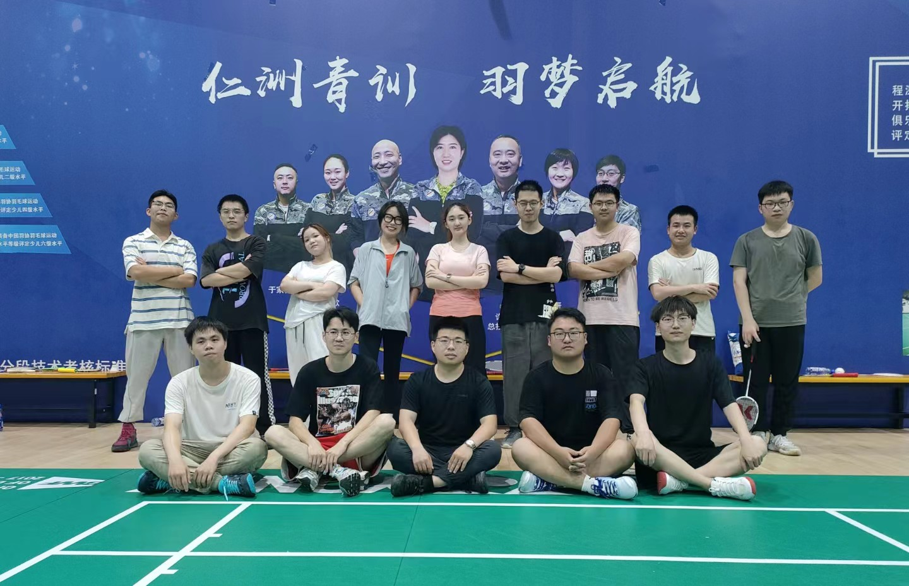

---
# This file represents a page section.
headless: true

# Order that this section appears on the page.
weight: 79

title: 课题组组织羽毛球活动
subtitle: ''

# Page order: descending (desc) or ascending (asc) date.
order: desc
design:
  # Choose a view for the listings:
  view: citation
  columns: '1'
---

 

2023年6月19日上午八点半，为了送别即将毕业的优秀学子，课题组举办了一场精彩纷呈的羽毛球赛。这场羽毛球赛不仅为课题组成员提供了放松身心的机会，同时也为他们创造了一个互动交流的平台。
 
课题组的老师和学生们积极参与，与毕业生们一同欢庆并展现了团队的凝聚力。选手们在比赛中展示了他们的技巧和运动天赋各自的表现得到了互相的认可和鼓励，让大家感受到了这个大家庭的温暖和友爱。
 
羽毛球赛的圆满举办不仅为欢送毕业生划上了一个美好的句号，也为整个课题组带来了积极向上的能量。这场活动不仅是一次身体上的锻炼，更是一次情感的释放和交流。
 
这场精彩纷呈的羽毛球赛不仅为毕业生送别增添了一抹亮色，更让全体参与者切实感受到了课题组大家庭的温暖和团结。希望毕业生们在未来的道路上能够继续展现自己的才华和能力。

 

    

 

 