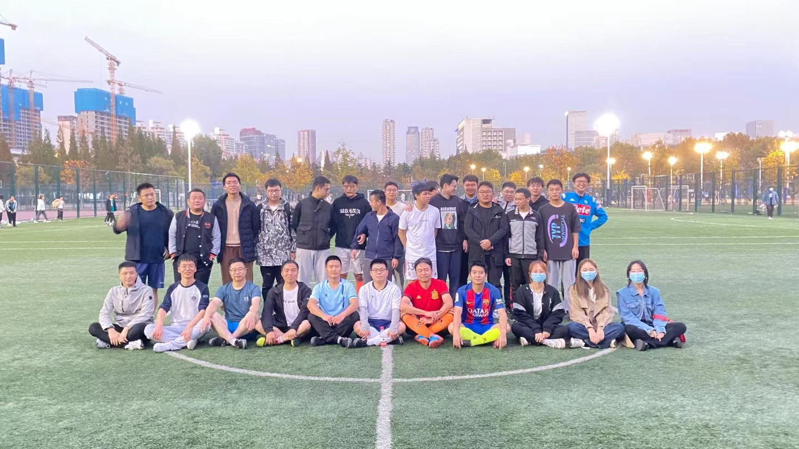

---
# This file represents a page section.
headless: true

# Order that this section appears on the page.
weight: 79

title: 课题组组织踢足球活动
subtitle: ''

# Page order: descending (desc) or ascending (asc) date.
order: desc
design:
  # Choose a view for the listings:
  view: citation
  columns: '1'
---

 

课题组在五人制足球场成功举办了一场激动人心的足球比赛。此次比赛旨在加强师生之间的交流与沟通，促进课题组成员的身体素质锻炼，营造融洽的团队氛围。
 
此次比赛除了促进师生之间的交流和健康生活方式，这场比赛更加强了课题组成员对团队合作和凝聚力的认识。课题组成员们表示，将以此次比赛为契机，更加努力地工作，为科学研究做出更大贡献。

 

    

 

 